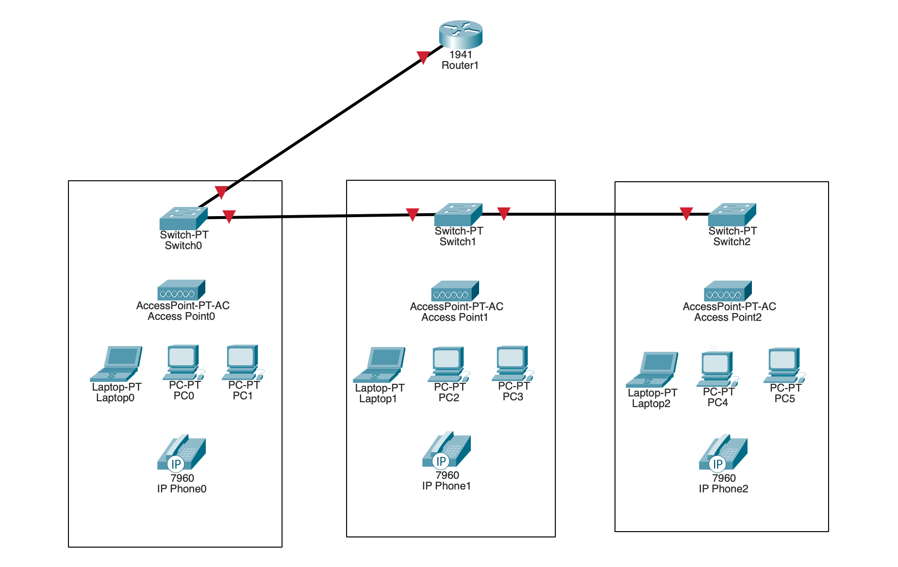
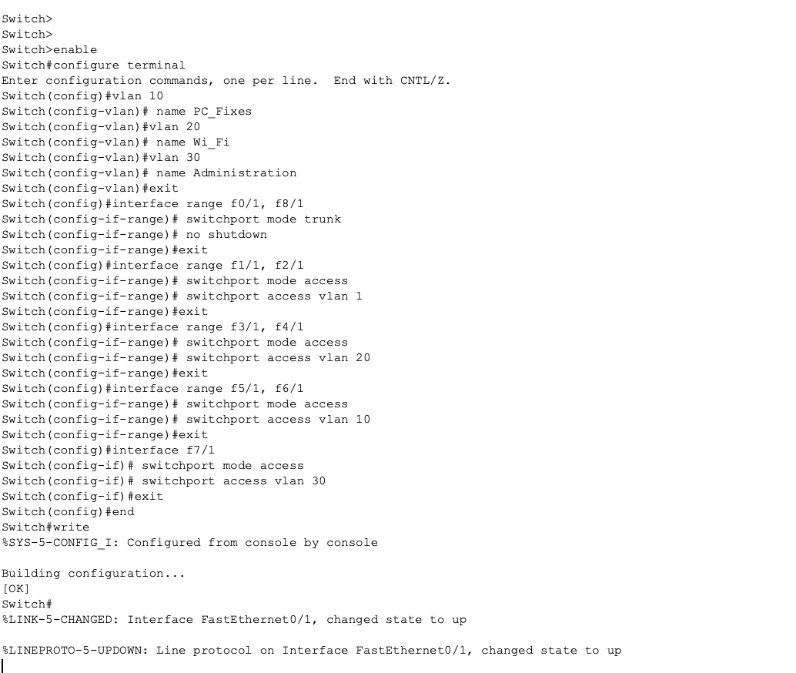
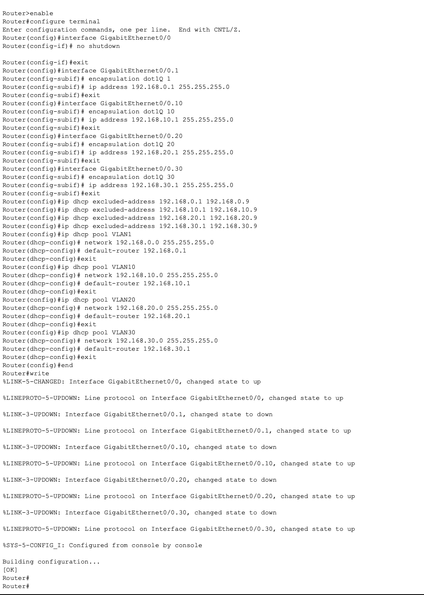
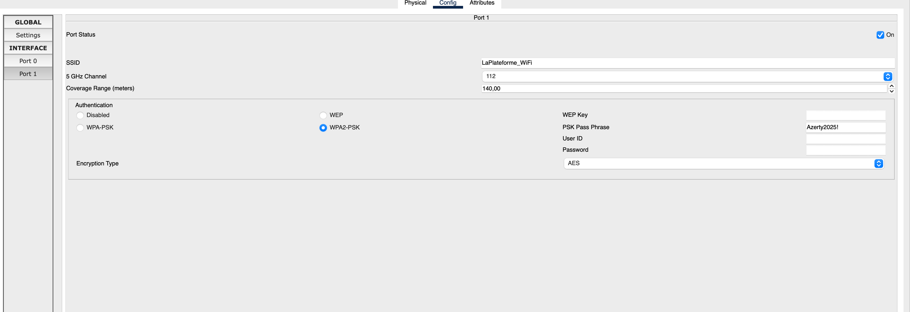
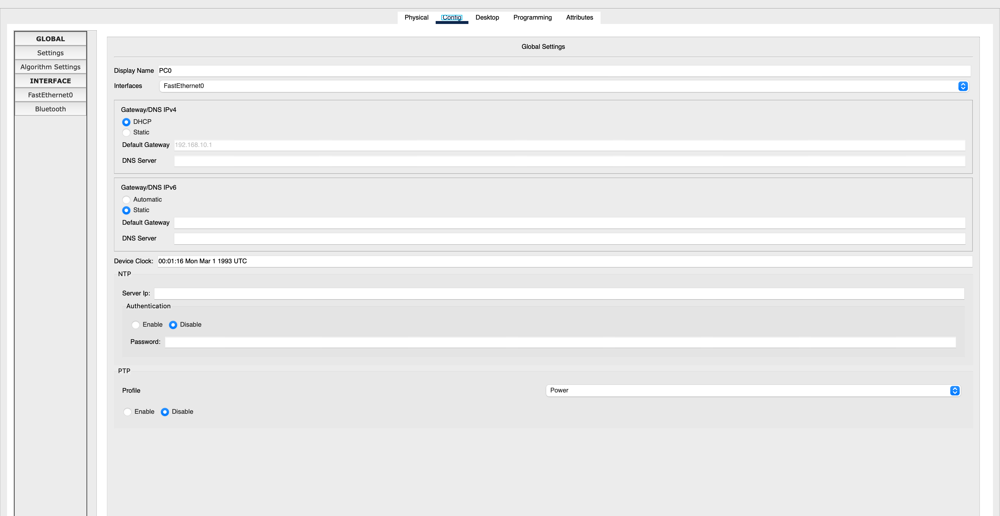
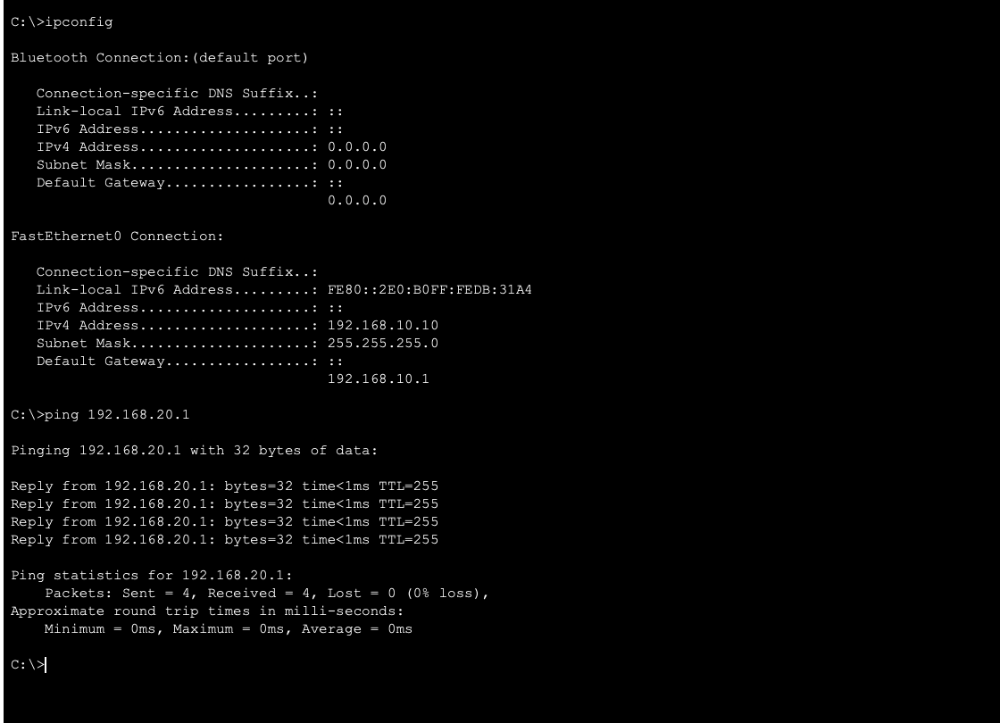
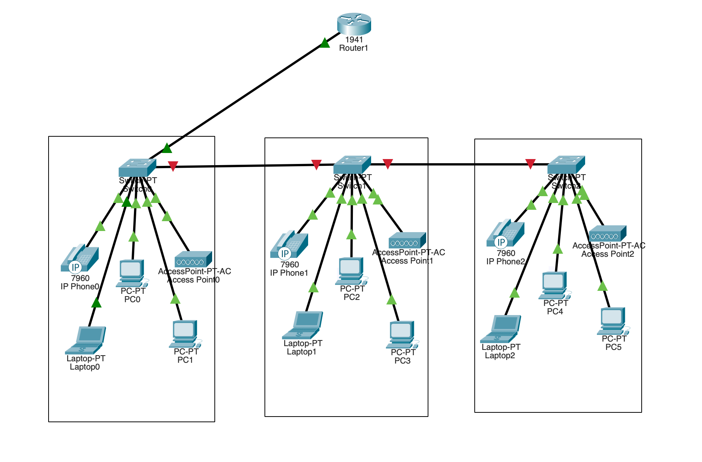
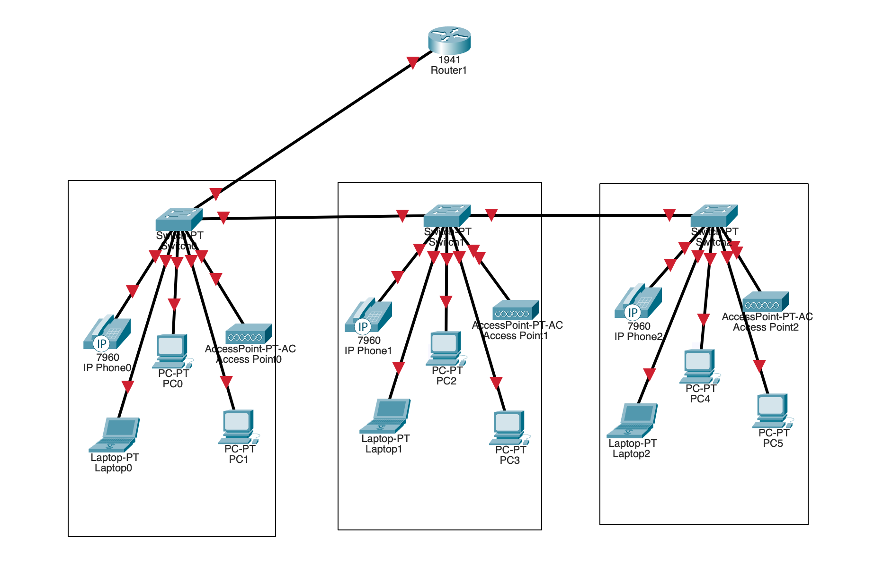
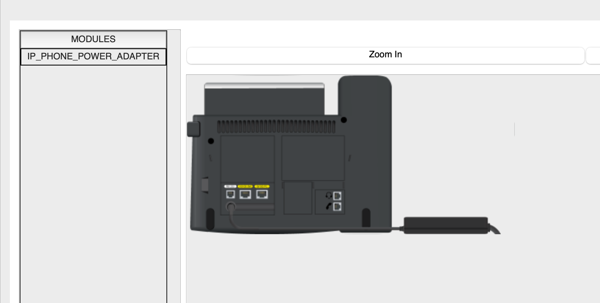

# Documentation — Test MSc Cyber — Exercice 01 (Packet Tracer)

## Introduction
Dans le cadre de la validation des compétences techniques pour intégrer le **MSc Cyber**, l’objectif de cet exercice est de créer et configurer un **miniLab Packet Tracer** avec :
- **Segmentation en VLAN**
- **Adressage + DHCP par VLAN**
- **Routage inter-VLAN** (router-on-a-stick)
- **Tests de connectivité** (entre VLAN + “accès Internet” selon la maquette)

Le dépôt contient :
- les **exports de configuration** des équipements (`Exercice_1/Configs/`)
- les **captures d’écran** (`Exercice_1/Images/`)

> Remarque : je ne vois pas de fichier Packet Tracer `.pkt` dans le dépôt à l’instant (\*.pkt introuvable). Si tu l’ajoutes plus tard, je te conseille de le placer à `Exercice_1/` et de l’indiquer dans la section **Livrables**.

## Matériel et topologie
**Équipements utilisés**
- 1 routeur **Cisco 1941**
- 3 switches **Switch-PT**
- 3 points d’accès **AccessPoint-PT-AC**
- 3 PC portables
- 6 PC fixes
- 3 téléphones IP **Cisco 7960** (IPBX non géré)

**Organisation par bureau (x3)**
Chaque bureau contient :
- 1 switch
- 1 point d’accès Wi‑Fi
- 1 PC portable
- 2 PC fixes
- 1 téléphone IP

### Schéma de la maquette


## VLAN et affectation des ports (par switch)
Le principe est identique sur les 3 switches : même répartition des ports et mêmes VLAN.

### VLAN
- **VLAN 1** : VoIP
- **VLAN 10** : PC fixes
- **VLAN 20** : Wi‑Fi (AP + clients Wi‑Fi)
- **VLAN 30** : Administration

### Mapping ports (Packet Tracer)
Sur les switches Packet Tracer, les interfaces apparaissent au format `FastEthernetX/1`.
L’équivalence “port” \(\rightarrow\) interface utilisée dans les configs est :
- **Port 1** \(\rightarrow\) `FastEthernet0/1` (**TRUNK** vers routeur / uplink)
- **Port 2** \(\rightarrow\) `FastEthernet1/1` (**ACCESS VLAN 1** — Téléphone IP)
- **Port 3** \(\rightarrow\) `FastEthernet2/1` (**ACCESS VLAN 1** — Téléphone IP)
- **Port 4** \(\rightarrow\) `FastEthernet3/1` (**ACCESS VLAN 20** — AP Wi‑Fi)
- **Port 5** \(\rightarrow\) `FastEthernet4/1` (**ACCESS VLAN 20** — AP Wi‑Fi)
- **Port 6** \(\rightarrow\) `FastEthernet5/1` (**ACCESS VLAN 10** — PC fixe)
- **Port 7** \(\rightarrow\) `FastEthernet6/1` (**ACCESS VLAN 10** — PC fixe)
- **Port 8** \(\rightarrow\) `FastEthernet7/1` (**ACCESS VLAN 30** — Administration)
- **Port 9** \(\rightarrow\) `FastEthernet8/1` (**TRUNK** vers uplink/switch suivant)

### Preuve de configuration switch (capture)


## Plan d’adressage et DHCP
Le routeur 1941 joue les rôles suivants :
- **Passerelle** pour chaque VLAN
- **Serveur DHCP** (un pool par VLAN)
- **Routage inter‑VLAN** via sous‑interfaces 802.1Q sur `G0/0`

### Plan d’adressage
| VLAN | Usage | Réseau | Passerelle |
|---:|---|---|---|
| 1 | VoIP | `192.168.0.0/24` | `192.168.0.1` |
| 10 | PC fixes | `192.168.10.0/24` | `192.168.10.1` |
| 20 | Wi‑Fi | `192.168.20.0/24` | `192.168.20.1` |
| 30 | Administration | `192.168.30.0/24` | `192.168.30.1` |

### DHCP
Les configs excluent `x.x.x.1` à `x.x.x.9` (réservés passerelles + éventuels statiques), donc les baux démarrent à **.10**.

> Si tu dois strictement respecter une plage `192.168.x.10` à `192.168.x.50`, il faut aussi exclure `192.168.x.51` à `192.168.x.254`. (Actuellement, la config DHCP autorise .10 → .254.)

### Preuve de configuration routeur (capture)


## Routage inter‑VLAN (Router-on-a-stick)
Le trunk entre le switch et le routeur transporte les VLAN 1/10/20/30.
Le routage se fait via les sous‑interfaces :
- `G0/0.1` : VLAN 1 **native**, IP `192.168.0.1/24`
- `G0/0.10` : VLAN 10, IP `192.168.10.1/24`
- `G0/0.20` : VLAN 20, IP `192.168.20.1/24`
- `G0/0.30` : VLAN 30, IP `192.168.30.1/24`

## Wi‑Fi
Les points d’accès sont raccordés en **Ethernet** sur les ports **VLAN 20**.
Les PC portables rejoignent le réseau via ces AP.



## Tests et validation
### 1) Attribution DHCP sur un poste
Un PC en VLAN 10 récupère bien une IP et la passerelle DHCP.



### 2) Inter‑VLAN OK (exemple)
Exemple de test depuis un hôte en `192.168.10.10` (VLAN 10) vers la passerelle du VLAN 20 `192.168.20.1` : **réponses OK**.



### 3) État de la connectivité globale
Visualisation Packet Tracer montrant les liens fonctionnels sur la maquette.



## Captures complémentaires (mise en place)
- **Câblage / organisation** :
  - 
- **Alimentation téléphone IP** :
  - 

## Livrables
Dans ce dépôt :
- **README** : ce document
- **Fichier Packet Tracer** : [`Exercice_1/Laplateforme_exercice1.pkt`](Exercice_1/Laplateforme_exercice1.pkt)
- **Exports de configurations** :
  - `Exercice_1/Configs/Routeur_config.txt`
  - `Exercice_1/Configs/Switch1_config.txt`
  - `Exercice_1/Configs/Switch2_config.txt`
  - `Exercice_1/Configs/Switch3_config.txt`
- **Captures** : `Exercice_1/Images/*.png`

## Annexes — exports complets

<details>
<summary><strong>Routeur Cisco 1941 — running-config (export)</strong></summary>

```text
enable
Router#show running-config
Building configuration...

Current configuration : 1536 bytes
!
version 15.1
no service timestamps log datetime msec
no service timestamps debug datetime msec
no service password-encryption
!
hostname Router
!
ip dhcp excluded-address 192.168.0.1 192.168.0.9
ip dhcp excluded-address 192.168.10.1 192.168.10.9
ip dhcp excluded-address 192.168.20.1 192.168.20.9
ip dhcp excluded-address 192.168.30.1 192.168.30.9
!
ip dhcp pool VLAN1
 network 192.168.0.0 255.255.255.0
 default-router 192.168.0.1
ip dhcp pool VLAN10
 network 192.168.10.0 255.255.255.0
 default-router 192.168.10.1
ip dhcp pool VLAN20
 network 192.168.20.0 255.255.255.0
 default-router 192.168.20.1
ip dhcp pool VLAN30
 network 192.168.30.0 255.255.255.0
 default-router 192.168.30.1
!
no ip cef
no ipv6 cef
!
spanning-tree mode pvst
!
interface GigabitEthernet0/0
 no ip address
 duplex auto
 speed auto
!
interface GigabitEthernet0/0.1
 encapsulation dot1Q 1 native
 ip address 192.168.0.1 255.255.255.0
!
interface GigabitEthernet0/0.10
 encapsulation dot1Q 10
 ip address 192.168.10.1 255.255.255.0
!
interface GigabitEthernet0/0.20
 encapsulation dot1Q 20
 ip address 192.168.20.1 255.255.255.0
!
interface GigabitEthernet0/0.30
 encapsulation dot1Q 30
 ip address 192.168.30.1 255.255.255.0
!
interface GigabitEthernet0/1
 no ip address
 duplex auto
 speed auto
 shutdown
!
interface Vlan1
 no ip address
 shutdown
!
ip classless
ip flow-export version 9
!
line con 0
line aux 0
line vty 0 4
 login
!
end

Router#
```
</details>

<details>
<summary><strong>Switch 1 — running-config (export)</strong></summary>

```text
Switch>enable
Switch#show running-config
Building configuration...

Current configuration : 1007 bytes
!
version 12.1
no service timestamps log datetime msec
no service timestamps debug datetime msec
no service password-encryption
!
hostname Switch
!
ptp clock transparent domain 0 profile default
!
spanning-tree mode pvst
spanning-tree extend system-id
!
interface FastEthernet0/1
 switchport mode trunk
!
interface FastEthernet1/1
 switchport mode access
!
interface FastEthernet2/1
 switchport mode access
!
interface FastEthernet3/1
 switchport access vlan 20
 switchport mode access
!
interface FastEthernet4/1
 switchport access vlan 20
 switchport mode access
!
interface FastEthernet5/1
 switchport access vlan 10
 switchport mode access
!
interface FastEthernet6/1
 switchport access vlan 10
 switchport mode access
!
interface FastEthernet7/1
 switchport access vlan 30
 switchport mode access
!
interface FastEthernet8/1
 switchport mode trunk
!
interface FastEthernet9/1
!
interface Vlan1
 no ip address
 shutdown
!
line con 0
line vty 0 4
 login
line vty 5 15
 login
!
end
```
</details>

<details>
<summary><strong>Switch 2 — running-config (export)</strong></summary>

```text
Switch>enable
Switch#show running-config
Building configuration...

Current configuration : 1007 bytes
!
version 12.1
no service timestamps log datetime msec
no service timestamps debug datetime msec
no service password-encryption
!
hostname Switch
!
ptp clock transparent domain 0 profile default
!
spanning-tree mode pvst
spanning-tree extend system-id
!
interface FastEthernet0/1
 switchport mode trunk
!
interface FastEthernet1/1
 switchport mode access
!
interface FastEthernet2/1
 switchport mode access
!
interface FastEthernet3/1
 switchport access vlan 20
 switchport mode access
!
interface FastEthernet4/1
 switchport access vlan 20
 switchport mode access
!
interface FastEthernet5/1
 switchport access vlan 10
 switchport mode access
!
interface FastEthernet6/1
 switchport access vlan 10
 switchport mode access
!
interface FastEthernet7/1
 switchport access vlan 30
 switchport mode access
!
interface FastEthernet8/1
 switchport mode trunk
!
interface FastEthernet9/1
!
interface Vlan1
 no ip address
 shutdown
!
line con 0
line vty 0 4
 login
line vty 5 15
 login
!
end
```
</details>

<details>
<summary><strong>Switch 3 — running-config (export)</strong></summary>

```text
Switch>enable
Switch#show running-config
Building configuration...

Current configuration : 1007 bytes
!
version 12.1
no service timestamps log datetime msec
no service timestamps debug datetime msec
no service password-encryption
!
hostname Switch
!
ptp clock transparent domain 0 profile default
!
spanning-tree mode pvst
spanning-tree extend system-id
!
interface FastEthernet0/1
 switchport mode trunk
!
interface FastEthernet1/1
 switchport mode access
!
interface FastEthernet2/1
 switchport mode access
!
interface FastEthernet3/1
 switchport access vlan 20
 switchport mode access
!
interface FastEthernet4/1
 switchport access vlan 20
 switchport mode access
!
interface FastEthernet5/1
 switchport access vlan 10
 switchport mode access
!
interface FastEthernet6/1
 switchport access vlan 10
 switchport mode access
!
interface FastEthernet7/1
 switchport access vlan 30
 switchport mode access
!
interface FastEthernet8/1
 switchport mode trunk
!
interface FastEthernet9/1
!
interface Vlan1
 no ip address
 shutdown
!
line con 0
line vty 0 4
 login
line vty 5 15
 login
!
end
```
</details>