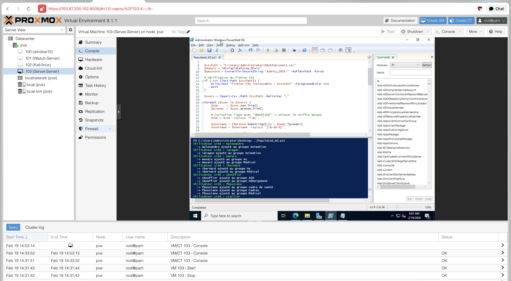
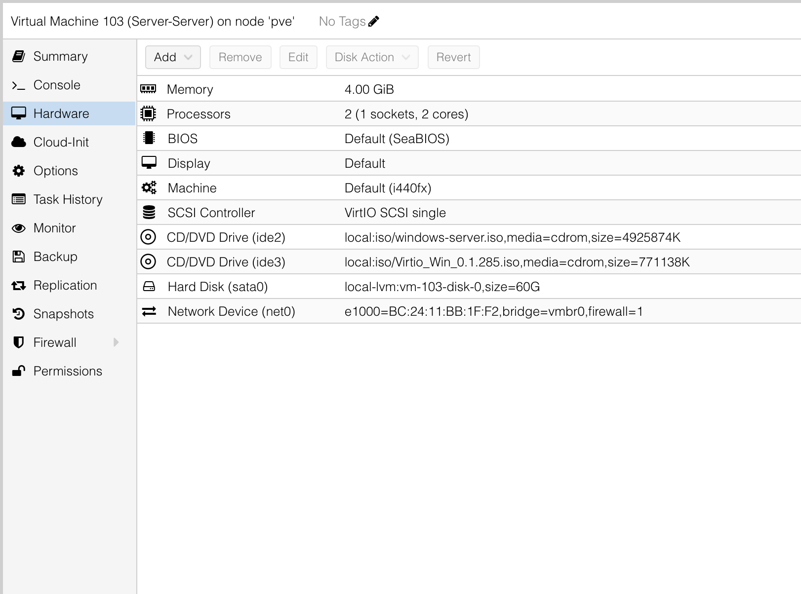
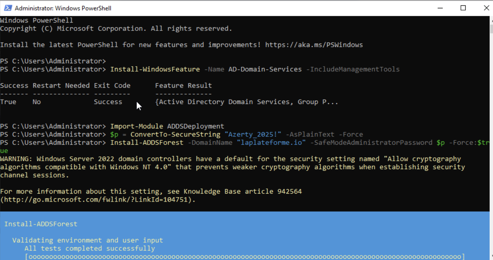
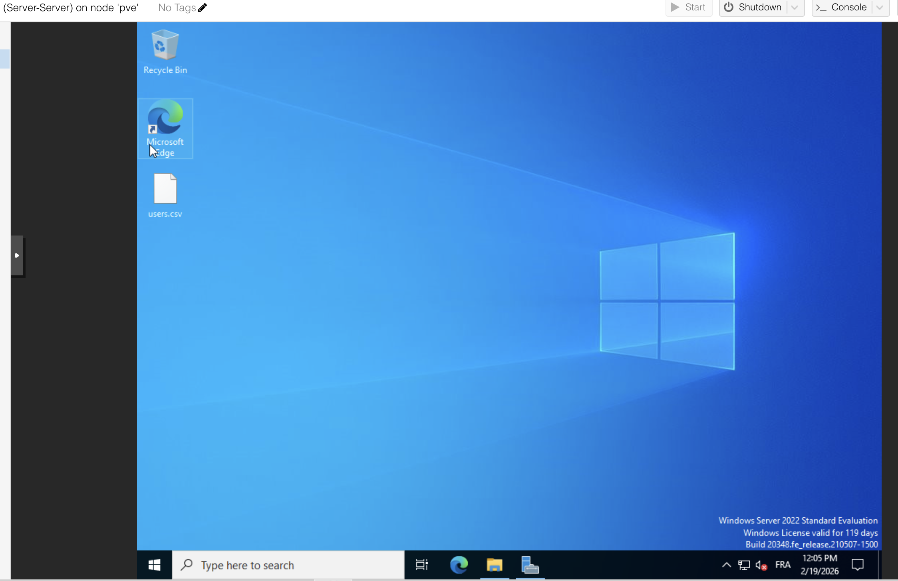
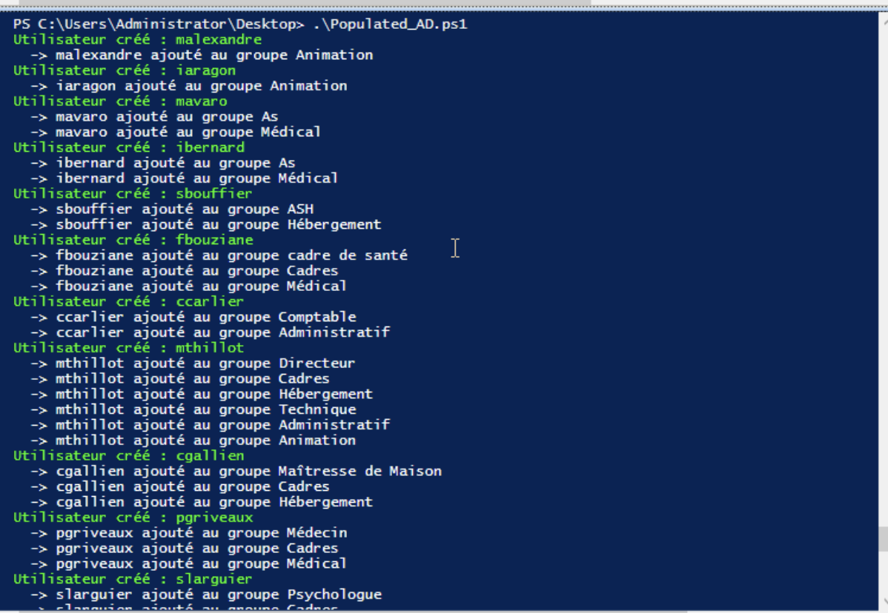
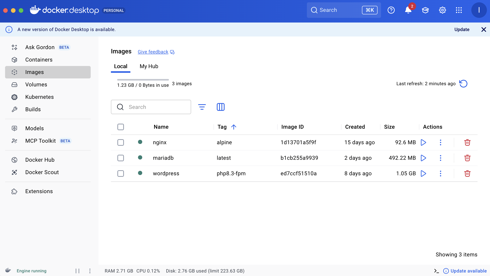
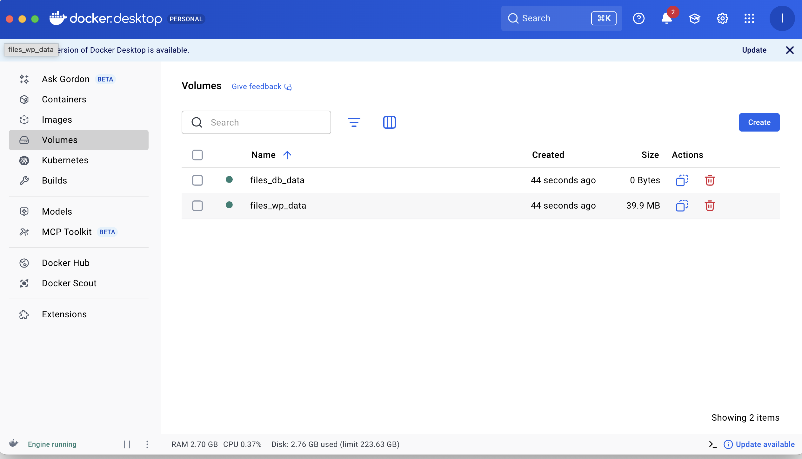
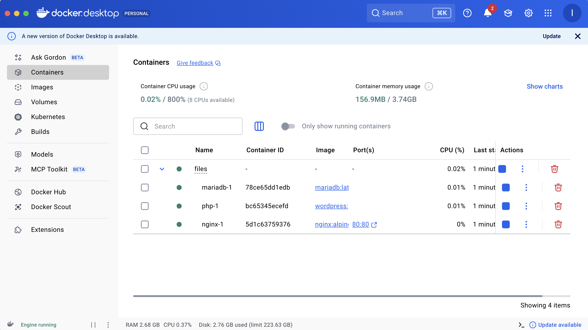
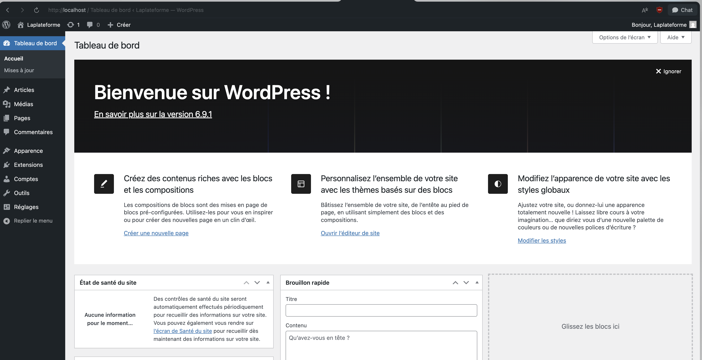

# Documentation — Test MSc Cyber

## Sommaire

- [Exercice 01 — Packet Tracer](#exercice-01-packet-tracer)
- [Exercice 02 — Active Directory](#exercice-02-active-directory)
- [Exercice 03 — Docker WordPress](#exercice-03-docker--wordpress)

---

# Exercice 01 (Packet Tracer)

## Introduction

Le dépôt contient :
- les **exports de configuration** des équipements (`Exercice_1/Configs/`)
- les **captures d’écran** (`Exercice_1/Images/`)

## Matériel et topologie

**Équipements utilisés**
- 1 routeur **Cisco 1941**
- 3 switches **Switch-PT**
- 3 points d’accès **AccessPoint-PT-AC**
- 3 PC portables
- 6 PC fixes
- 3 téléphones IP **Cisco 7960** (IPBX non géré)

**Organisation par bureau (x3)**
Chaque bureau contient :
- 1 switch
- 1 point d’accès Wi‑Fi
- 1 PC portable
- 2 PC fixes
- 1 téléphone IP

### Schéma de la maquette


## VLAN et affectation des ports (par switch)
Le principe est identique sur les 3 switches : même répartition des ports et mêmes VLAN.

### VLAN
- **VLAN 1** : VoIP
- **VLAN 10** : PC fixes
- **VLAN 20** : Wi‑Fi (AP + clients Wi‑Fi)
- **VLAN 30** : Administration

### Mapping ports (Packet Tracer)

Sur les switches Packet Tracer, les interfaces apparaissent au format `FastEthernetX/1`.
L’équivalence “port” \(\rightarrow\) interface utilisée dans les configs est :
- **Port 1** \(\rightarrow\) `FastEthernet0/1` (**TRUNK** vers routeur / uplink)
- **Port 2** \(\rightarrow\) `FastEthernet1/1` (**ACCESS VLAN 1** — Téléphone IP)
- **Port 3** \(\rightarrow\) `FastEthernet2/1` (**ACCESS VLAN 1** — Téléphone IP)
- **Port 4** \(\rightarrow\) `FastEthernet3/1` (**ACCESS VLAN 20** — AP Wi‑Fi)
- **Port 5** \(\rightarrow\) `FastEthernet4/1` (**ACCESS VLAN 20** — AP Wi‑Fi)
- **Port 6** \(\rightarrow\) `FastEthernet5/1` (**ACCESS VLAN 10** — PC fixe)
- **Port 7** \(\rightarrow\) `FastEthernet6/1` (**ACCESS VLAN 10** — PC fixe)
- **Port 8** \(\rightarrow\) `FastEthernet7/1` (**ACCESS VLAN 30** — Administration)
- **Port 9** \(\rightarrow\) `FastEthernet8/1` (**TRUNK** vers uplink/switch suivant)

### Preuve de configuration switch (capture)


## Plan d’adressage et DHCP
Le routeur 1941 joue les rôles suivants :
- **Passerelle** pour chaque VLAN
- **Serveur DHCP** (un pool par VLAN)
- **Routage inter‑VLAN** via sous‑interfaces 802.1Q sur `G0/0`

### Plan d’adressage
| VLAN | Usage | Réseau | Passerelle |
|---:|---|---|---|
| 1 | VoIP | `192.168.0.0/24` | `192.168.0.1` |
| 10 | PC fixes | `192.168.10.0/24` | `192.168.10.1` |
| 20 | Wi‑Fi | `192.168.20.0/24` | `192.168.20.1` |
| 30 | Administration | `192.168.30.0/24` | `192.168.30.1` |

### DHCP
Les configs excluent `x.x.x.1` à `x.x.x.9` (réservés passerelles + éventuels statiques), donc les baux démarrent à **.10**.


### Preuve de configuration routeur (capture)


## Routage inter‑VLAN (Router-on-a-stick)

Le trunk entre le switch et le routeur transporte les VLAN 1/10/20/30.
Le routage se fait via les sous‑interfaces :
- `G0/0.1` : VLAN 1 **native**, IP `192.168.0.1/24`
- `G0/0.10` : VLAN 10, IP `192.168.10.1/24`
- `G0/0.20` : VLAN 20, IP `192.168.20.1/24`
- `G0/0.30` : VLAN 30, IP `192.168.30.1/24`

## Wi‑Fi
Les points d’accès sont raccordés en **Ethernet** sur les ports **VLAN 20**.
Les PC portables rejoignent le réseau via ces AP.


## Tests et validation
### 1) Attribution DHCP sur un poste
Un PC en VLAN 10 récupère bien une IP et la passerelle DHCP.


### 2) Inter‑VLAN OK (exemple)
Exemple de test depuis un hôte en `192.168.10.10` (VLAN 10) vers la passerelle du VLAN 20 `192.168.20.1` : **réponses OK**.


### 3) État de la connectivité globale
Visualisation Packet Tracer montrant les liens fonctionnels sur la maquette.


## Captures complémentaires (mise en place)
- **Câblage / organisation** :
  - 
- **Alimentation téléphone IP** :
  - 

## Livrables
Dans ce dépôt :
- **README** : ce document
- **Fichier Packet Tracer** : [`Exercice_1/Laplateforme_exercice1.pkt`](Exercice_1/Laplateforme_exercice1.pkt)
- **Exports de configurations** :
  - `Exercice_1/Configs/Routeur_config.txt`
  - `Exercice_1/Configs/Switch1_config.txt`
  - `Exercice_1/Configs/Switch2_config.txt`
  - `Exercice_1/Configs/Switch3_config.txt`
- **Captures** : `Exercice_1/Images/*.png`


## Annexes — exports complets

<details>
<summary><strong>Routeur Cisco 1941 — running-config (export)</strong></summary>

```text
enable
Router#show running-config
Building configuration...

Current configuration : 1536 bytes
!
version 15.1
no service timestamps log datetime msec
no service timestamps debug datetime msec
no service password-encryption
!
hostname Router
!
ip dhcp excluded-address 192.168.0.1 192.168.0.9
ip dhcp excluded-address 192.168.10.1 192.168.10.9
ip dhcp excluded-address 192.168.20.1 192.168.20.9
ip dhcp excluded-address 192.168.30.1 192.168.30.9
!
ip dhcp pool VLAN1
 network 192.168.0.0 255.255.255.0
 default-router 192.168.0.1
ip dhcp pool VLAN10
 network 192.168.10.0 255.255.255.0
 default-router 192.168.10.1
ip dhcp pool VLAN20
 network 192.168.20.0 255.255.255.0
 default-router 192.168.20.1
ip dhcp pool VLAN30
 network 192.168.30.0 255.255.255.0
 default-router 192.168.30.1
!
no ip cef
no ipv6 cef
!
spanning-tree mode pvst
!
interface GigabitEthernet0/0
 no ip address
 duplex auto
 speed auto
!
interface GigabitEthernet0/0.1
 encapsulation dot1Q 1 native
 ip address 192.168.0.1 255.255.255.0
!
interface GigabitEthernet0/0.10
 encapsulation dot1Q 10
 ip address 192.168.10.1 255.255.255.0
!
interface GigabitEthernet0/0.20
 encapsulation dot1Q 20
 ip address 192.168.20.1 255.255.255.0
!
interface GigabitEthernet0/0.30
 encapsulation dot1Q 30
 ip address 192.168.30.1 255.255.255.0
!
interface GigabitEthernet0/1
 no ip address
 duplex auto
 speed auto
 shutdown
!
interface Vlan1
 no ip address
 shutdown
!
ip classless
ip flow-export version 9
!
line con 0
line aux 0
line vty 0 4
 login
!
end

Router#
```
</details>

<details>
<summary><strong>Switch 1 — running-config (export)</strong></summary>

```text
Switch>enable
Switch#show running-config
Building configuration...

Current configuration : 1007 bytes
!
version 12.1
no service timestamps log datetime msec
no service timestamps debug datetime msec
no service password-encryption
!
hostname Switch
!
ptp clock transparent domain 0 profile default
!
spanning-tree mode pvst
spanning-tree extend system-id
!
interface FastEthernet0/1
 switchport mode trunk
!
interface FastEthernet1/1
 switchport mode access
!
interface FastEthernet2/1
 switchport mode access
!
interface FastEthernet3/1
 switchport access vlan 20
 switchport mode access
!
interface FastEthernet4/1
 switchport access vlan 20
 switchport mode access
!
interface FastEthernet5/1
 switchport access vlan 10
 switchport mode access
!
interface FastEthernet6/1
 switchport access vlan 10
 switchport mode access
!
interface FastEthernet7/1
 switchport access vlan 30
 switchport mode access
!
interface FastEthernet8/1
 switchport mode trunk
!
interface FastEthernet9/1
!
interface Vlan1
 no ip address
 shutdown
!
line con 0
line vty 0 4
 login
line vty 5 15
 login
!
end
```
</details>

<details>
<summary><strong>Switch 2 — running-config (export)</strong></summary>

```text
Switch>enable
Switch#show running-config
Building configuration...

Current configuration : 1007 bytes
!
version 12.1
no service timestamps log datetime msec
no service timestamps debug datetime msec
no service password-encryption
!
hostname Switch
!
ptp clock transparent domain 0 profile default
!
spanning-tree mode pvst
spanning-tree extend system-id
!
interface FastEthernet0/1
 switchport mode trunk
!
interface FastEthernet1/1
 switchport mode access
!
interface FastEthernet2/1
 switchport mode access
!
interface FastEthernet3/1
 switchport access vlan 20
 switchport mode access
!
interface FastEthernet4/1
 switchport access vlan 20
 switchport mode access
!
interface FastEthernet5/1
 switchport access vlan 10
 switchport mode access
!
interface FastEthernet6/1
 switchport access vlan 10
 switchport mode access
!
interface FastEthernet7/1
 switchport access vlan 30
 switchport mode access
!
interface FastEthernet8/1
 switchport mode trunk
!
interface FastEthernet9/1
!
interface Vlan1
 no ip address
 shutdown
!
line con 0
line vty 0 4
 login
line vty 5 15
 login
!
end
```
</details>

<details>
<summary><strong>Switch 3 — running-config (export)</strong></summary>

```text
Switch>enable
Switch#show running-config
Building configuration...

Current configuration : 1007 bytes
!
version 12.1
no service timestamps log datetime msec
no service timestamps debug datetime msec
no service password-encryption
!
hostname Switch
!
ptp clock transparent domain 0 profile default
!
spanning-tree mode pvst
spanning-tree extend system-id
!
interface FastEthernet0/1
 switchport mode trunk
!
interface FastEthernet1/1
 switchport mode access
!
interface FastEthernet2/1
 switchport mode access
!
interface FastEthernet3/1
 switchport access vlan 20
 switchport mode access
!
interface FastEthernet4/1
 switchport access vlan 20
 switchport mode access
!
interface FastEthernet5/1
 switchport access vlan 10
 switchport mode access
!
interface FastEthernet6/1
 switchport access vlan 10
 switchport mode access
!
interface FastEthernet7/1
 switchport access vlan 30
 switchport mode access
!
interface FastEthernet8/1
 switchport mode trunk
!
interface FastEthernet9/1
!
interface Vlan1
 no ip address
 shutdown
!
line con 0
line vty 0 4
 login
line vty 5 15
 login
!
end
```
</details>

---

# Exercice 02 (Active Directory)

**Disclaimer — Environnement de travail**

Cet exercice nécessite un Windows Server. Étant sur macOS, il m'est impossible d'exécuter Windows Server nativement. J'ai donc mis en place un serveur **Proxmox VE** sur lequel j'ai déployé une machine virtuelle **Windows Server 2022** pour réaliser l'intégralité de l'exercice.

## Environnement

| Composant | Détail |
|---|---|
| Hyperviseur | Proxmox VE |
| OS invité | Windows Server 2022 |
| Domaine AD | `laplateforme.io` |
| Outil utilisé | PowerShell (Administrateur) |




## Étape 1 — Installation d'Active Directory

Le script `01_install_AD.ps1` installe le rôle AD DS puis promeut le serveur en contrôleur de domaine. Le serveur redémarre automatiquement à la fin.

```powershell
Install-WindowsFeature -Name AD-Domain-Services -IncludeManagementTools

$password = ConvertTo-SecureString "Azerty_2025!" -AsPlainText -Force

Install-ADDSForest `
    -DomainName "laplateforme.io" `
    -DomainNetbiosName "LAPLATEFORME" `
    -SafeModeAdministratorPassword $password `
    -InstallDns $true `
    -Force $true
```




## Étape 2 — Peuplement de l'AD

Après redémarrage, le script `02_populate_AD.ps1` crée les OU, les groupes et les utilisateurs depuis le fichier `users.csv`.

```powershell
Import-Module ActiveDirectory

$domainDN  = "DC=laplateforme,DC=io"
$ouRoot    = "OU=LaPlateforme,$domainDN"
$ouUsers   = "OU=Utilisateurs,$ouRoot"
$ouGroups  = "OU=Groupes,$ouRoot"
$password  = ConvertTo-SecureString "Azerty_2025!" -AsPlainText -Force
$csvPath   = "$PSScriptRoot\users.csv"

New-ADOrganizationalUnit -Name "LaPlateforme" -Path $domainDN
New-ADOrganizationalUnit -Name "Utilisateurs" -Path $ouRoot
New-ADOrganizationalUnit -Name "Groupes"      -Path $ouRoot

$users = Import-Csv -Path $csvPath -Encoding UTF8

$groups = @()
foreach ($user in $users) {
    for ($i = 1; $i -le 6; $i++) {
        $g = $user."groupe$i"
        if ($g -and $g -ne "" -and $groups -notcontains $g) {
            $groups += $g
        }
    }
}

foreach ($g in $groups) {
    New-ADGroup -Name $g -GroupScope Global -GroupCategory Security -Path $ouGroups
}

foreach ($user in $users) {
    $sam  = $user.prénom.Substring(0,1).ToLower() + "." + $user.nom.ToLower()
    $sam  = $sam -replace "[^a-z0-9\.]", ""

    New-ADUser `
        -Name                  "$($user.prénom) $($user.nom)" `
        -GivenName             $user.prénom `
        -Surname               $user.nom `
        -SamAccountName        $sam `
        -UserPrincipalName     "$sam@laplateforme.io" `
        -AccountPassword       $password `
        -ChangePasswordAtLogon $true `
        -Enabled               $true `
        -Path                  $ouUsers

    for ($i = 1; $i -le 6; $i++) {
        $g = $user."groupe$i"
        if ($g -and $g -ne "") {
            Add-ADGroupMember -Identity $g -Members $sam
        }
    }
}
```




## Livrables

Dans ce dépôt :
- **README** : ce document
- **Script 01** : [`Exercice_2/Scripts/01_install_AD.ps1`](Exercice_2/Scripts/01_install_AD.ps1)
- **Script 02** : [`Exercice_2/Scripts/02_populate_AD.ps1`](Exercice_2/Scripts/02_populate_AD.ps1)
- **Fichier CSV** : [`Exercice_2/Scripts/users.csv`](Exercice_2/Scripts/users.csv)
- **Captures** : `Exercice_2/Images/*.png`

---

# Exercice 03 (Docker — WordPress)

## Objectif

Déployer WordPress en isolant chaque rôle dans un container dédié, reliés entre eux via un réseau Docker interne et un volume partagé.

## Stack

| Container | Image | Rôle |
|---|---|---|
| `nginx` | `nginx:alpine` | Reçoit les requêtes HTTP (port 80). Sert les fichiers statiques directement et délègue le PHP au container `php` via FastCGI. |
| `php` | `wordpress:php8.3-fpm` | Exécute le code PHP de WordPress (PHP-FPM sur le port 9000). Se connecte à `mariadb` pour lire et écrire les données. |
| `mariadb` | `mariadb:latest` | Base de données SQL. Stocke tout le contenu WordPress : articles, utilisateurs, paramètres. |

Les 3 images sont téléchargées automatiquement au premier `docker compose up` :



## Volumes

Deux volumes nommés sont créés pour que les données **persistent** même si les containers sont supprimés ou redémarrés :

- **`files_wp_data`** (39,9 MB) — monté dans `nginx` **et** `php` sur `/var/www/html`. C'est le **volume commun** : nginx y lit les fichiers statiques, php y exécute les fichiers WordPress. Les deux containers partagent exactement le même dossier.
- **`files_db_data`** — monté uniquement dans `mariadb` sur `/var/lib/mysql`. Contient toutes les données SQL.



## Fichiers

### `docker-compose.yaml`

```yaml
services:

  mariadb:
    image: mariadb:latest
    restart: always
    environment:
      MYSQL_DATABASE: wordpress
      MYSQL_USER: wordpress
      MYSQL_PASSWORD: wordpress
      MYSQL_ROOT_PASSWORD: rootpassword
    volumes:
      - db_data:/var/lib/mysql

  php:
    image: wordpress:php8.3-fpm
    restart: always
    environment:
      WORDPRESS_DB_HOST: mariadb
      WORDPRESS_DB_NAME: wordpress
      WORDPRESS_DB_USER: wordpress
      WORDPRESS_DB_PASSWORD: wordpress
    volumes:
      - wp_data:/var/www/html
    depends_on:
      - mariadb

  nginx:
    image: nginx:alpine
    restart: always
    ports:
      - "80:80"
    volumes:
      - wp_data:/var/www/html
      - ./nginx.conf:/etc/nginx/conf.d/default.conf
    depends_on:
      - php

volumes:
  db_data:
  wp_data:
```

`depends_on` garantit l'ordre de démarrage : `mariadb` → `php` → `nginx`.

### `nginx.conf`

```nginx
server {
    listen 80;
    root /var/www/html;
    index index.php;

    location / {
        try_files $uri $uri/ /index.php?$args;
    }

    location ~ \.php$ {
        fastcgi_pass    php:9000;
        fastcgi_index   index.php;
        include         fastcgi_params;
        fastcgi_param   SCRIPT_FILENAME $document_root$fastcgi_script_name;
    }

    location ~ /\.ht {
        deny all;
    }
}
```

`try_files` cherche d'abord un fichier statique correspondant à l'URL ; si rien ne correspond, il renvoie vers `index.php` (c'est ainsi que WordPress gère ses URLs propres). `fastcgi_pass php:9000` transmet les fichiers `.php` au container `php` via le réseau Docker interne.

## Lancement

```bash
cd Exercice_3/Files
docker compose up -d
```

Les 3 containers démarrent en arrière-plan :



WordPress est accessible sur `http://localhost`. L'assistant d'installation apparaît au premier lancement pour définir le nom du site, l'utilisateur admin et le mot de passe.



## Livrables

Dans ce dépôt :
- **README** : ce document
- **docker-compose** : [`Exercice_3/Files/docker-compose.yaml`](Exercice_3/Files/docker-compose.yaml)
- **Config nginx** : [`Exercice_3/Files/nginx.conf`](Exercice_3/Files/nginx.conf)
- **Captures** : `Exercice_3/Images/*.png`

